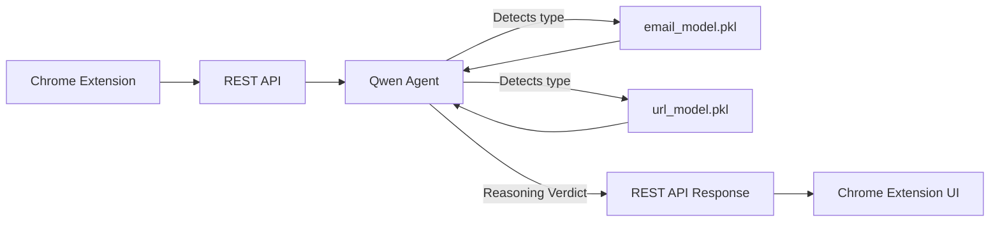

---

# 🛡️ Phish AI — Agentic Phishing Detection System


### “An AI-driven project that behaves like an antivirus for phishing emails and URLs.”

---

## 📘 Overview

**Phish AI** is an intelligent browser security system that detects and flags potential phishing attempts in real time.
It combines traditional ML models with an **agentic reasoning layer powered by Qwen**, enabling flexible decision-making and human-like contextual awareness.

The system identifies whether an input is an **email or a URL**, routes it to the correct model (`email_model.pkl` or `url_model.pkl`), collects the model’s response, and then **Qwen fuses the result** to produce a final, explainable verdict.

---

## 🧠 System Architecture

```
Chrome Extension → REST API → Qwen Agent → {email_model.pkl | url_model.pkl} → Qwen Reasoning → Verdict → REST API → Chrome UI
```

### 🧩 Component Breakdown

#### **1. Frontend**

* Runs directly in the browser.
* Scans URLs and email text on web pages (e.g., Gmail, LinkedIn, etc.).
* Sends content securely to the backend REST API for analysis.
* Displays a colored verdict badge:

  * 🟢 **Safe**
  * 🟡 **Suspicious**
  * 🔴 **Malicious**

#### **2. REST API Backend**

* Built using **FastAPI** or **Flask**.
* Endpoint: `/api/check`
* Routes user input (URL or email) to the Qwen reasoning core.
* Returns a JSON verdict to the extension UI.

#### **3. Qwen Mini-Agent (Agentic Reasoning Core)**

* The **intelligent router and decision-maker** of the system.

* Tasks:

  1. Detects if input is a URL or email.
  2. Sends it to the respective ML model.
  3. Collects model prediction.
  4. Performs reasoning to produce a human-readable, confidence-based verdict.

* Qwen prompt logic (simplified):

  ```
  if "@" in input or has multiple sentences → send to email_model.pkl
  else if "http" or "." in input → send to url_model.pkl
  collect result and reason:
     - high probability → malicious
     - medium → suspicious
     - low → safe
  ```

#### **4. ML Models**

* **email_model.pkl** — Classifies phishing likelihood in email text.
* **url_model.pkl** — Detects malicious patterns or domains in URLs.
* Output Example:

  ```json
  { "probability": 0.83, "type": "phishing" }
  ```

#### **5. Decision Fusion**

* After model inference, Qwen reasons using probabilities and patterns.
* Example final decision:

  ```json
  {
    "verdict": "malicious",
    "confidence": 0.92,
    "explanation": "Suspicious URL tokens and urgent email language detected.",
    "recommended_action": "block_and_quarantine"
  }
  ```

---

## 🌐 REST API Example

### **Endpoint:**

`POST /api/check`

### **Request:**

```json
{
  "input": "Dear user, please verify your account here: https://secure-login.xyz",
  "metadata": { "source": "gmail" }
}
```

### **Backend Flow:**

1. Qwen classifies input type (email or URL).
2. Sends it to the correct `.pkl` model.
3. Receives probability score.
4. Performs reasoning → verdict → sends back to REST API.

### **Response:**

```json
{
  "verdict": "malicious",
  "confidence": 0.91,
  "explanation": "Email urges password reset and links to blacklisted domain.",
  "recommended_action": "block_and_quarantine"
}
```

---


## 🚀 How It Works (Step-by-Step)

1. User visits a page or opens an email.
2. The Chrome Extension captures either:

   * a **URL**, or
   * an **email snippet**.
3. Sends data to the `/api/check` endpoint.
4. Qwen detects input type and routes to the right model:

   * **email_model.pkl** → phishing probability for emails.
   * **url_model.pkl** → phishing probability for URLs.
5. Qwen fuses probabilities, reasons about context, and generates:

   * **Verdict**
   * **Confidence**
   * **Explanation**
   * **Recommended Action**
6. REST API sends this back to the extension → displayed to user.

---

## 📊 Example Flow Diagram (Mermaid)



---

## 🧱 Tech Stack

* **Frontend:** Chrome Extension (HTML, JS)
* **Backend:** Python (FastAPI / Flask)
* **Models:** Scikit-learn / PyTorch (`.pkl`)
* **Reasoning Layer:** Qwen (small variant)
* **Storage:** Optional SQLite / JSON logs

---

## 🧪 Example Output

| Input Type | Model Used      | Verdict    | Confidence | Action             |
| ---------- | --------------- | ---------- | ---------- | ------------------ |
| URL        | url_model.pkl   | Suspicious | 0.78       | Warn User          |
| Email      | email_model.pkl | Malicious  | 0.93       | Block & Quarantine |

---

## 🧰 Future Enhancements

* 🧩 Continuous retraining using new phishing samples.
* 🧠 Adaptive feedback: user reports improve future decisions.
* ☁️ Cloud deployment with load-balanced API.
* 🔒 Domain reputation check integration (VirusTotal, PhishTank).
* 📊 Dashboard for monitoring detected threats.

---
